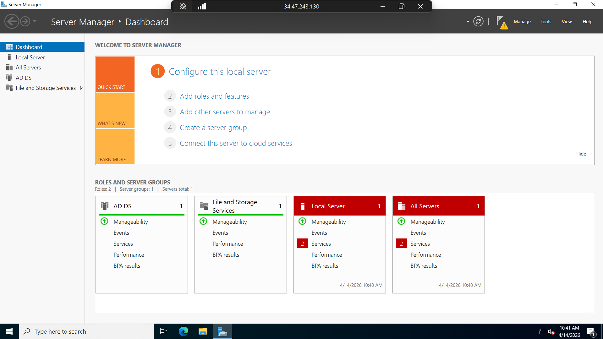

<h1 align="center">SOC Lab: Active Directory Monitoring with Splunk</h1>

<p align="center">
A hands-on SOC project simulating real-world log monitoring, attack detection, and incident analysis using Splunk SIEM.
</p>

---

## Objective
The objective of this project is to build a real-world SOC lab where logs from an Active Directory environment are centrally collected, monitored, and analyzed using Splunk SIEM to detect suspicious activities such as brute-force attacks and failed login attempts.

---

## Lab Architecture

<p align="center">

</p>

---

## Tools & Technologies

- Splunk SIEM  
- Active Directory (Windows Server 2022)  
- Windows 10 Client  
- Kali Linux  
- Sysmon  
- Splunk Universal Forwarder  
- Atomic Red Team  

---

## Project Overview

This project simulates an enterprise SOC environment with:
- Active Directory (Domain Controller)
- Windows 10 endpoint
- Splunk SIEM server

Logs are collected using Sysmon and Splunk Universal Forwarder.  
Attack scenarios are generated using Kali Linux and Atomic Red Team to test detection capabilities.

---

## Step-by-Step Implementation

### 1. Environment Setup
- Created virtual lab network  
- Ensured all systems are in same subnet  

---

### 2. Active Directory Setup

<p align="center">

</p>

- Installed Windows Server  
- Configured Domain Controller (`corp.local`)  
- Created domain users  

---

### 3. Splunk Setup
- Installed Splunk Enterprise  
- Configured indexes and data inputs  

---

### 4. Log Forwarding
- Installed Sysmon on endpoints  
- Installed Splunk Universal Forwarder  
- Forwarded logs to Splunk  

---

### 5. Log Verification

<p align="center">

</p>

- Verified Windows Event Logs  
- Verified Sysmon logs in Splunk  

---

### 6. Attack Simulation

<p align="center">

</p>

- Used Kali Linux  
- Used Atomic Red Team  
- Simulated brute-force attacks  

---

## Detection Use Case: Brute Force Attack

### Goal
Detect multiple failed login attempts indicating brute-force behavior.

---

### Logs Used
- Windows Security Logs  
- Event ID 4625 (Failed Login)  

---

### Detection Logic
- Multiple failed logins  
- Same user or IP  
- Short time duration  

---

### Splunk Query

```spl
index=windows EventCode=4625
| stats count by user, src_ip
| where count > 5
