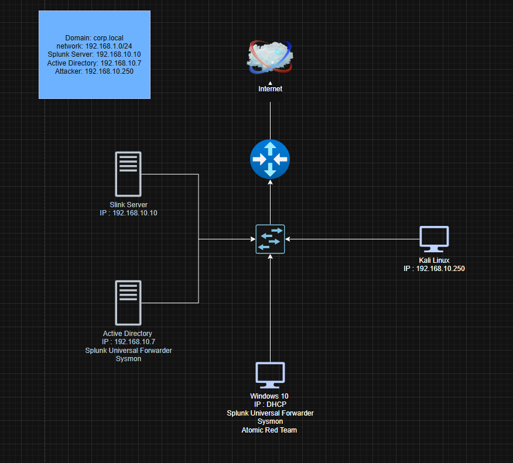
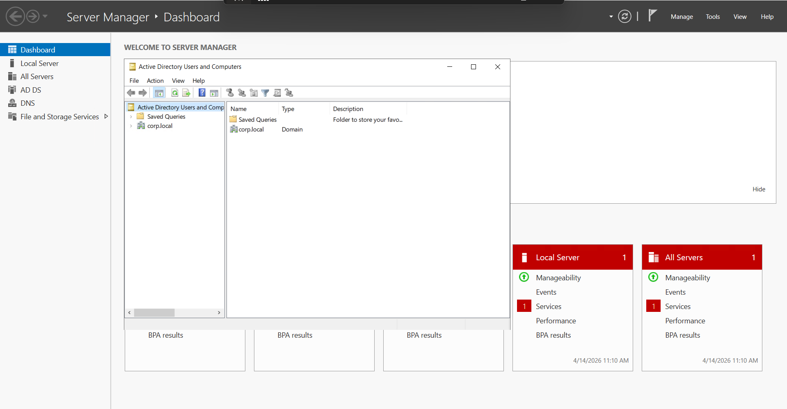
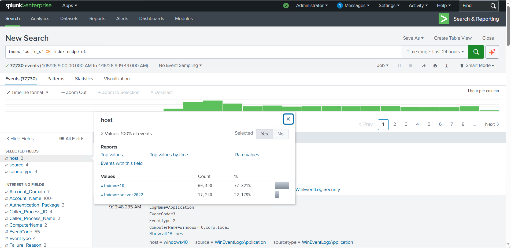
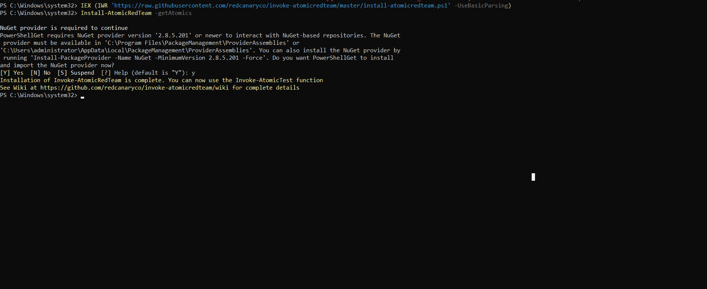
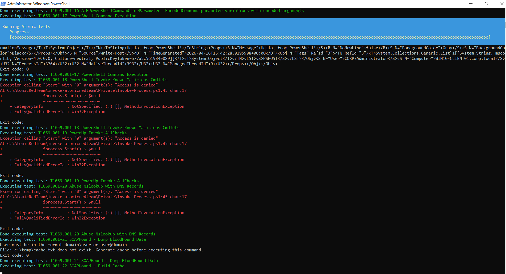

<h1 align="center">SOC Lab: Active Directory Monitoring with Splunk</h1>

A hands-on Security Operations Center (SOC) lab simulating real-world log collection, attack detection, and incident response using Splunk SIEM.

<h2>Objective</h2>

The goal of this project is to design and implement a real-world SOC lab environment where logs from an Active Directory infrastructure are centrally collected, monitored, and analyzed using Splunk SIEM. The lab focuses on detecting and investigating security incidents such as brute-force login attempts and suspicious activities.

<h2>Lab Architecture</h2>

The lab consists of a Windows Server acting as a Domain Controller, a Windows 10 client machine, and a Splunk SIEM server. Logs are generated from endpoints and forwarded to Splunk for centralized monitoring and analysis.

<h2>Tools & Technologies</h2>

<ul>
<li>Splunk SIEM</li>
<li>Windows Server 2022 (Active Directory)</li>
<li>Windows 10 Client</li>
<li>Kali Linux</li>
<li>Sysmon</li>
<li>Splunk Universal Forwarder</li>
<li>Atomic Red Team</li>
</ul>

<h2>Project Overview</h2>

This project simulates an enterprise-level SOC environment with centralized logging and monitoring. The infrastructure includes:

<ul>
<li>Active Directory Domain Controller</li>
<li>Windows 10 endpoint</li>
<li>Splunk SIEM server</li>
</ul>

Logs are collected using Sysmon and forwarded via Splunk Universal Forwarder. Attack simulations are conducted using Kali Linux and Atomic Red Team to validate detection mechanisms.

<h2>Step-by-Step Implementation</h2>

<h3>1. Environment Setup</h3>
<ul>
<li>Created a virtual lab environment using virtualization</li>
<li>Configured networking to ensure all machines are in the same subnet</li>
<li>Verified connectivity between all systems</li>
</ul>

<h3>2. Active Directory Setup</h3>
<ul>
<li>Installed Windows Server 2022</li>
<li>Configured Domain Controller (corp.local)</li>
<li>Created domain users and organizational units</li>
<li>Verified domain authentication</li>
</ul>

<h3>3. Splunk SIEM Setup</h3>
<ul>
<li>Installed Splunk Enterprise</li>
<li>Configured indexes for log storage</li>
<li>Set up data inputs for Windows and Sysmon logs</li>
</ul>

<h3>4. Log Forwarding Configuration</h3>
<ul>
<li>Installed Sysmon on endpoints for detailed logging</li>
<li>Installed Splunk Universal Forwarder on Windows systems</li>
<li>Configured forwarding of logs to Splunk server</li>
</ul>

<h3>5. Log Verification</h3>
<ul>
<li>Verified ingestion of Windows Event Logs</li>
<li>Verified Sysmon logs in Splunk dashboard</li>
<li>Ensured logs are properly parsed and searchable</li>
</ul>

<h3>6. Attack Simulation</h3>
<ul>
<li>Used Kali Linux to perform simulated attacks</li>
<li>Executed Atomic Red Team techniques</li>
<li>Generated brute-force login attempts</li>
</ul>

<h2>Detection Use Case: Brute Force Attack</h2>

<h3>Objective</h3>

Identify repeated failed login attempts that indicate a brute-force attack against domain accounts.

<h3>Log Source</h3>
<ul>
<li>Windows Security Logs</li>
<li>Event ID 4625 (Failed Login Attempts)</li>
</ul>

<h3>Detection Logic</h3>
<ul>
<li>Multiple failed login attempts</li>
<li>Same username or source IP</li>
<li>Within a short time interval</li>
</ul>

<h3>Splunk Query</h3>

<pre>
index=windows EventCode=4625
| stats count by user, src_ip
| where count > 5
</pre>

<h3>Detection Output</h3>

<h2>PowerShell Activity Detection</h2>

Suspicious PowerShell activity was monitored using Sysmon logs and analyzed in Splunk to detect potential malicious commands.

<h2>Alerts & Monitoring</h2>

Custom alerts were configured in Splunk to notify when suspicious activities such as repeated failed logins are detected.

<h2>Incident Analysis (SOC Perspective)</h2>

<ul>
<li>Identified suspicious IP generating multiple failed logins</li>
<li>Correlated logs across endpoints</li>
<li>Analyzed event patterns in Splunk</li>
<li>Determined brute-force attack behavior</li>
</ul>

<h3>Response Actions</h3>
<ul>
<li>Recommended blocking source IP</li>
<li>Suggested account lockout policy enforcement</li>
<li>Escalated incident to higher-level SOC team</li>
</ul>

<h2>Key Learnings</h2>

<ul>
<li>Hands-on experience with SIEM (Splunk)</li>
<li>Understanding of Windows Event Logs and Sysmon</li>
<li>Threat detection and log analysis techniques</li>
<li>SOC workflow and incident response process</li>
</ul>

<h2>Future Improvements</h2>

<ul>
<li>Integration with SOAR tools (Shuffle)</li>
<li>Advanced correlation rules</li>
<li>Automated alert response</li>
<li>Dashboard creation for real-time monitoring</li>
</ul>

<h2>Author</h2>

Syed Mujtaba Ahmed 
SOC Analyst

